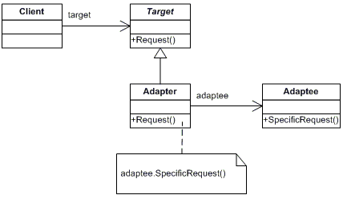

# Adapter Pattern

## Overview
The Adapter design pattern is a structural design pattern used when a client class has to use another class (adaptee) that it cannot recognize. 
This unfamiliar class is wrapped inside Adapter class by exposing interface to the client different than that of the adapter. 
This enabling the client to use the functionality of the adaptee without having a interface dependency on it.

## Intent

## UML Class Diagram

## Code Example
The example shows how the adapter class hides the details of SQL database access from the client. 

The class adapts the client request to sql way and sql response to client understandable way. 

## Mapping UML to example 

## Points to Remember

## Reference 
