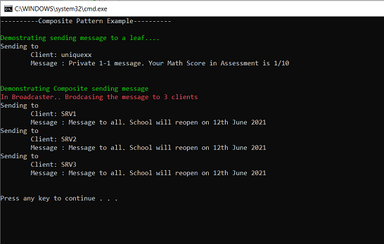

# Composite (Structural Pattern)

## Overview
Composite is a structural design pattern that lets you compose objects into tree structures and then work with these structures as if they were individual objects

## Intent
-Composite pattern enables clients of an interface to treat the individual objects and objects composed into a tree structure uniformly 
-Composite will be treated by the client atomically and the internal children of the composite are not exposed to the client

## UML Diagram

## Code Example

## Example Output

## Mapping the UML classes to Example code
| **File/Class Name** | **Mapping Class in UML**  |
| :-----: | :-: |
|[Base.interfaces/IClient.cs](./Base.interfaces/IClient.cs)|*Component Interface*|
|[Imp.Clients/SingleClient.cs](./Imp.Clients/SingleClient.cs)|*Leaf*|
|[Imp.Clients/Broadcaster.cs](./Imp.Clients/Broadcaster.cs)|*Composite*|
|[Imp.Clients/Client1.cs](./Imp.Clients/Client1.cs)|*Leaf1*|
|[Imp.Clients/Client2.cs](./Imp.Clients/Client2.cs)|*Leaf2*|
|[Imp.Clients/Client3.cs](./Imp.Clients/Client3.cs)|*Leaf3*|

## Points to Remember
- Typically used in places where we have composites that contain components, each of which could be a composite
- 
## Resources
- https://refactoring.guru/design-patterns/composite
- https://sourcemaking.com/design_patterns/composite
