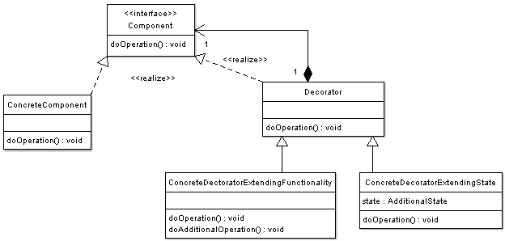

# (Structural Pattern)

## Overview

## Intent

## UML Diagram

## Code Example

## Example Output

## Mapping the UML classes to Example code
| **File/Class Name** | **Mapping Class in UML**  |
| :-----: | :-: |

## Points to Remember
Difference Between Proxy and Decorator
 - Proxy provides the same interface. Decorator provides an enhanced interface.
- Decorator and Proxy have different purposes but similar structures. Both describe how to provide a level of indirection to another object, and the implementations keep a reference to the object to which they forward requests.
- Decorator can be viewed as a degenerate Composite with only one component. However, a Decorator adds additional responsibilities - it isn't intended for object aggregation.
- Decorator supports recursive composition
- The Decorator class declares a composition relationship to the LCD (Lowest Class Denominator) interface, and this data member is initialized in its constructor.
- Proxy class is used for lazy initialization, performance improvement by caching the object and controlling access to the client/caller

## Resources
