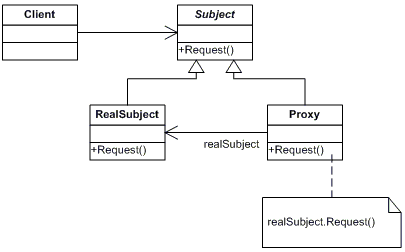

# Proxy Pattern (Structural Pattern)

## Overview

## Intent

## UML Diagram

## Code Example

## Example Output

## Mapping the UML classes to Example code

## Points to Remember

## Resources
- https://howtodoinjava.com/design-patterns/structural/proxy-design-pattern/
